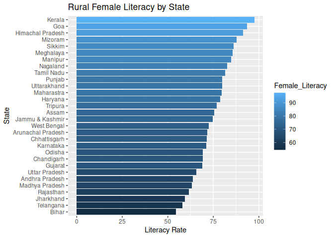
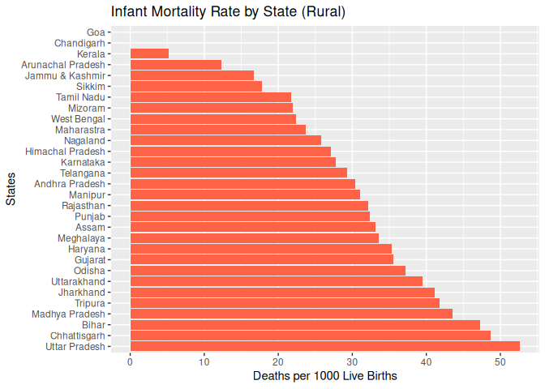
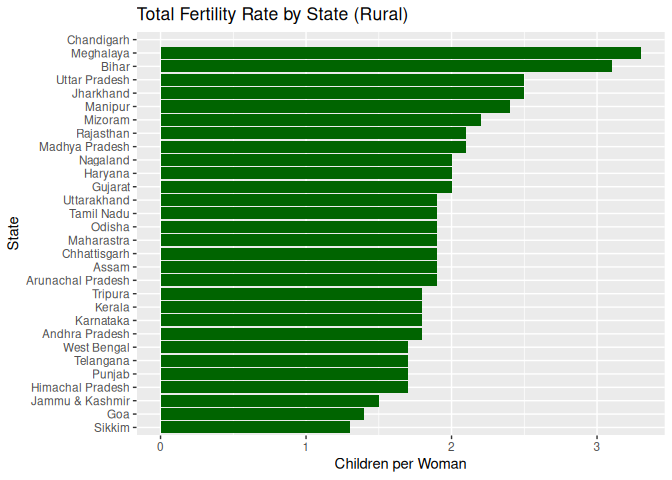
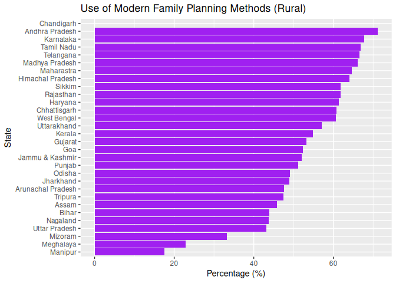
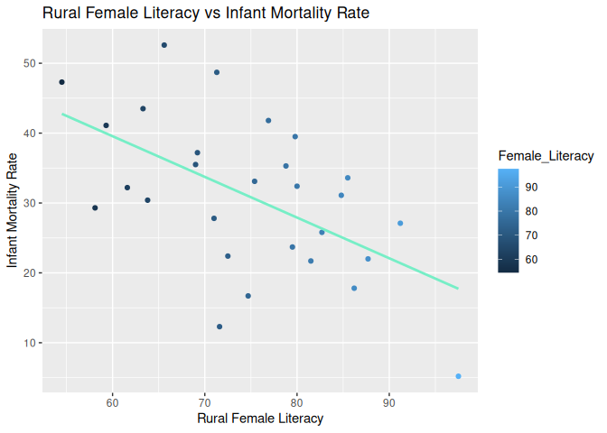
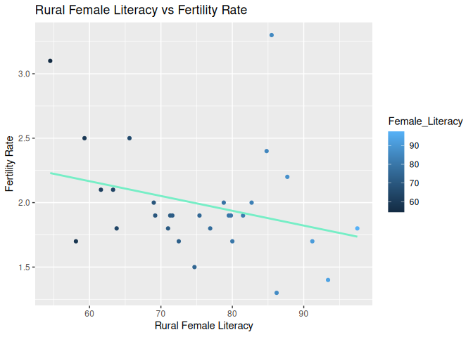
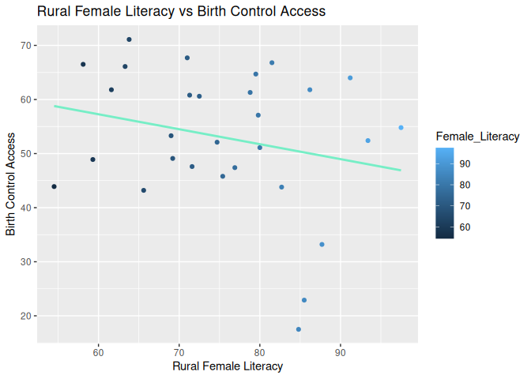
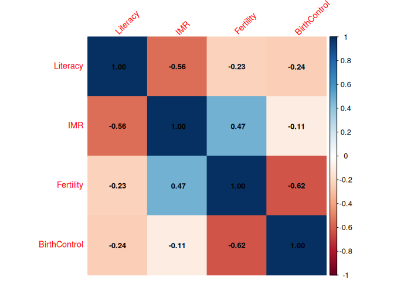

Understanding the Impact of Rural Female Literacy on Key Socio-Health
Indicators in India
================
Aleena Santhosh

## Introduction

Female Literacy is a key indicator of social and economic development of
women in a country. Understanding its impact on varied aspects of
women’s lives is crucial for policy planning, gender equality, and rural
development. This analysis focuses on rural female literacy rates across
Indian states. The objective is to explore patterns, identify
disparities, and understand how literacy impacts socio-health
indicators.

The analysis uses the National Family and Health Survey-5 dataset. It
seeks to explore the relationship between rural female literacy and
factors like Infant Mortality Rate, Fertility Rate, and access to birth
control for women.

The analysis involves data cleaning, filtering, summary statistics, and
visualization.

## Data Cleaning

The National Family and Health Survey dataset contained a vast set of
variables, from which the required variables for the analysis were to be
filtered and cleaned. The dataset also contained information on both
states and union territories. Given the scope of the analysis, only the
states data was retained. All values were converted into numeric to
ensure that the input for statistical analysis was accurate.

``` r
female_lit <- 
nfhs_data %>% mutate(Female_Literacy = as.numeric(
gsub("\\(|\\)", "", `Women (age 15-49) who are literate4 (%)`)),
Infant_Mortality_Rate = as.numeric(gsub("\\(|\\)", "", 
`Infant mortality rate (per 1000 live births)`)),
`Total Fertility Rate (number of children per woman)` = as.numeric(gsub("[^0-9.]", "", 
      `Total Fertility Rate (number of children per woman)`))) %>% 
select(`States/UTs`, `Area`, `Female_Literacy`,
`Total Fertility Rate (number of children per woman)`,
`Infant_Mortality_Rate`,
`Current Use of Family Planning Methods (Currently Married Women Age 15-49  years) - Any modern method6 (%)`) %>% 
rename("Use of Modern Family Planning Methods (%)" = 
`Current Use of Family Planning Methods (Currently Married Women Age 15-49  years) - Any modern method6 (%)`,
           "States" = `States/UTs`) %>%
    filter(!States %in% c("India",
           "Andaman & Nicobar Islands",
         "Dadra and Nagar Haveli & Daman and Diu",
         "Ladakh",
         "Lakshadweep",
         "NCT of Delhi",
         "Puducherry"),
          Area == "Rural")
```

The raw dataset contained missing and inconsistent values. Some cells
used the symbol `*` to represent missing data, and certain numeric
columns were stored as character values.

To ensure accurate analysis, the dataset was cleaned by replacing
invalid entries and converting variables into appropriate data types.

``` r
female_lit <- female_lit %>% 
  mutate(across(
    c(`Total Fertility Rate (number of children per woman)`,
      `Use of Modern Family Planning Methods (%)`),
    ~ as.numeric(na_if(as.character(.x), "*"))
  ))
```

## Summary Statistics

After cleaning the dataset and filtering out Union Territories, summary
statistics were computed to understand overall literacy patterns.

The mean rural female literacy rate provides a general measure of
literacy levels across states.

``` r
mean(female_lit$Female_Literacy, na.rm = TRUE)
```

    ## [1] 75.18667

The average rural female literacy rate across states is approximately
**75.18%**. This indicates the overall level of literacy among women in
rural areas, though significant variation exists between states.

``` r
summary(female_lit$Female_Literacy)
```

    ##    Min. 1st Qu.  Median    Mean 3rd Qu.    Max. 
    ##   54.50   69.05   75.05   75.19   82.40   97.50

The summary statistics show the minimum, maximum, median, and quartile
distribution of literacy rates, highlighting disparities across states.

## Visualization

To better understand the variation in rural female literacy across
states, a bar chart was created. This visualization helps compare
literacy rates and identify high- and low-performing states.

``` r
ggplot(female_lit, aes(x = reorder(States, Female_Literacy),
                        y = Female_Literacy,
                       fill = Female_Literacy)) +
  geom_bar(stat = "identity") +
  coord_flip() +
  labs(title = "Rural Female Literacy by State",
       x = "State",
       y = "Literacy Rate")
```

<!-- -->

The bar chart displays rural female literacy rates across states in
ascending order.The visualization highlights clear disparities between
states, indicating that rural female literacy is unevenly distributed
across the country.

## Distribution of Key Variables

### Infant Mortality Rate

``` r
ggplot(female_lit, aes(x = reorder(States, -Infant_Mortality_Rate),
                        y = Infant_Mortality_Rate)) +
  geom_bar(stat = "identity", fill = "tomato") +
  coord_flip() +
  labs(title = "Infant Mortality Rate by State (Rural)",
       x = "States",
       y = "Deaths per 1000 Live Births")
```

<!-- -->

### Fertility Rate

``` r
ggplot(female_lit, aes(x = reorder(States,
                        `Total Fertility Rate (number of children per woman)`),
                        y = `Total Fertility Rate (number of children per woman)`)) +
  geom_bar(stat = "identity", fill = "darkgreen") +
  coord_flip() +
  labs(title = "Total Fertility Rate by State (Rural)",
       x = "State",
       y = "Children per Woman")
```

<!-- -->

### Use of Birth Control Methods

``` r
ggplot(female_lit, aes(x = reorder(States,
        `Use of Modern Family Planning Methods (%)`),
        y = `Use of Modern Family Planning Methods (%)`)) +
  geom_bar(stat = "identity", fill = "purple") +
  coord_flip() +
  labs(title = "Use of Modern Family Planning Methods (Rural)",
       x = "State",
       y = "Percentage (%)")
```

<!-- -->

## Exploring the relationship between the variables

### Literacy vs Infant Mortality Rate

``` r
#Literacy vs IMR
ggplot(female_lit, aes(x = Female_Literacy, 
                     y = Infant_Mortality_Rate)) +
  geom_point(aes(colour = Female_Literacy)) +
  geom_smooth(method = "lm", colour = "aquamarine2", se = FALSE) +
  labs(title = "Rural Female Literacy vs Infant Mortality Rate",
       x = "Rural Female Literacy",
       y = "Infant Mortality Rate")
```

<!-- -->

A strong inverse relationship is observed between rural female literacy
and infant mortality rate. States with higher literacy among women
consistently report lower infant mortality, highlighting the critical
role of education in improving child health outcomes. Educated women are
more likely to access healthcare services, follow better nutrition and
hygiene practices and ensure child vaccination.

### Literacy vs Total Fertility Rate

``` r
#Literacy vs Fertility
ggplot(female_lit, aes(x = Female_Literacy, 
                      y = `Total Fertility Rate (number of children per woman)`)) +
  geom_point(aes(colour = Female_Literacy)) +
  geom_smooth(method = "lm", colour = "aquamarine2", se = FALSE) +
  labs(title = "Rural Female Literacy vs Fertility Rate",
       x = "Rural Female Literacy",
       y = "Fertility Rate")
```

<!-- -->

Rural female literacy shows a moderate negative association with
fertility rates, suggesting that increased education contributes to
smaller family sizes and more controlled population growth. Educated
women tend to delay marriage and childbirth and make informed
reproductive choices.

### Literacy vs Use of Birth Control Methods

``` r
#Literacy vs Birth Control Access

ggplot(female_lit, aes(x = Female_Literacy, 
                     y = `Use of Modern Family Planning Methods (%)`)) +
  geom_point(aes(colour = Female_Literacy)) +
  geom_smooth(method = "lm", colour = "aquamarine2", se = FALSE) +
  labs(title = "Rural Female Literacy vs Birth Control Access",
       x = "Rural Female Literacy",
       y = "Birth Control Access")
```

<!-- -->

The relationship between rural female literacy and access to birth
control appears weak and slightly negative, indicating that factors
beyond education — such as cultural norms and public health outreach —
play a significant role in determining contraceptive use.

Among the variables analyzed, infant mortality rate exhibits the
strongest relationship with rural female literacy, followed by fertility
rate, while access to birth control shows a comparatively weak and
inconsistent association.

## Correlation Analysis

A correlation analysis was conducted to examine the relationships
between rural female literacy and key demographic indicators.

``` r
literacy_cor <- female_lit %>%
  select(Female_Literacy, Infant_Mortality_Rate,
         `Total Fertility Rate (number of children per woman)`,
         `Use of Modern Family Planning Methods (%)`) %>%
  mutate(across(everything(), as.numeric))
```

``` r
#Shortening col names for a cleaner map
colnames(literacy_cor) <- c("Literacy", "IMR", "Fertility", "BirthControl")

#running correlation
cor_matrix <- cor(literacy_cor, use = "complete.obs")
cor_matrix
```

    ##                Literacy        IMR  Fertility BirthControl
    ## Literacy      1.0000000 -0.5570990 -0.2266096   -0.2447998
    ## IMR          -0.5570990  1.0000000  0.4741788   -0.1081805
    ## Fertility    -0.2266096  0.4741788  1.0000000   -0.6226581
    ## BirthControl -0.2447998 -0.1081805 -0.6226581    1.0000000

Female literacy exhibits a moderately strong negative correlation with
infant mortality rate (-0.56), indicating that higher levels of
education among women are associated with improved child health outcomes
and reduced infant deaths.

A weak negative correlation (-0.23) is observed between female literacy
and fertility rate, suggesting that while education contributes to lower
birth rates, its impact is limited compared to other influencing
factors.

The relationship between female literacy and the use of modern family
planning methods is weak and slightly negative (-0.24), suggesting that
access to or use of contraceptive methods is influenced by factors
beyond education alone.

``` r
#Heatmap
corrplot(
  cor_matrix,
  method = "color",
  addCoef.col = "black",
  tl.cex = 0.9,
  number.cex = 0.8,
  tl.srt = 45
)
```

<!-- -->

The correlation heat map highlights that female literacy is most
strongly associated with reductions in infant mortality, while its
relationship with fertility and contraceptive use remains relatively
weak. In contrast, access to modern family planning methods exhibits a
strong influence on fertility rates. These findings suggest that
improving education and expanding healthcare access together are
essential for achieving better demographic and health outcomes.

## Regression Analysis

Building on the correlation analysis, this section applies linear
regression to evaluate the extent to which female literacy predicts
variations in key socio-health indicators. This provides a deeper
understanding of both strength and significance of these relationships.

``` r
reg_data <- female_lit %>%
  select(`Total Fertility Rate (number of children per woman)`, Female_Literacy, Infant_Mortality_Rate,`Use of Modern Family Planning Methods (%)`) %>%
  na.omit()

#Infant Mortality Rate
model_imr <- lm(Infant_Mortality_Rate ~ Female_Literacy, data = reg_data)

#Fertility Rate
model_tfr <- lm(`Total Fertility Rate (number of children per woman)` ~ Female_Literacy, data = reg_data)

#Birth Control
model_bc <- lm(`Use of Modern Family Planning Methods (%)` ~ Female_Literacy, data = reg_data)
```

``` r
summary_table <- data.frame(
  Variable = c("Infant Mortality Rate", "Fertility Rate", "Birth Control Use"),
  Intercept = c(coef(model_imr)[1], coef(model_tfr)[1], coef(model_bc)[1]),
  Slope = c(coef(model_imr)[2], coef(model_tfr)[2], coef(model_bc)[2]),
  R_squared = c(summary(model_imr)$r.squared,
                summary(model_tfr)$r.squared,
                summary(model_bc)$r.squared),
  P_value = c(summary(model_imr)$coefficients[2,4],
              summary(model_tfr)$coefficients[2,4],
              summary(model_bc)$coefficients[2,4])
)

library(kableExtra)

summary_table %>%
  kable(digits = 3, caption = "Regression Results Summary", format = "markdown") %>%
  kable_styling(latex_options = c("striped", "hold_position"))
```

<table class="table" style="margin-left: auto; margin-right: auto;">

<caption>

Regression Results Summary
</caption>

<thead>

<tr>

<th style="text-align:left;">

Variable
</th>

<th style="text-align:right;">

Intercept
</th>

<th style="text-align:right;">

Slope
</th>

<th style="text-align:right;">

R_squared
</th>

<th style="text-align:right;">

P_value
</th>

</tr>

</thead>

<tbody>

<tr>

<td style="text-align:left;">

Infant Mortality Rate
</td>

<td style="text-align:right;">

74.489
</td>

<td style="text-align:right;">

-0.582
</td>

<td style="text-align:right;">

0.310
</td>

<td style="text-align:right;">

0.002
</td>

</tr>

<tr>

<td style="text-align:left;">

Fertility Rate
</td>

<td style="text-align:right;">

2.693
</td>

<td style="text-align:right;">

-0.009
</td>

<td style="text-align:right;">

0.051
</td>

<td style="text-align:right;">

0.246
</td>

</tr>

<tr>

<td style="text-align:left;">

Birth Control Use
</td>

<td style="text-align:right;">

75.705
</td>

<td style="text-align:right;">

-0.303
</td>

<td style="text-align:right;">

0.060
</td>

<td style="text-align:right;">

0.209
</td>

</tr>

</tbody>

</table>

### Infant Mortality Rate

There is a statistically significant negative relationship between
female literacy and infant mortality rate. Specifically, a 1 percentage
point increase in female literacy is associated with a decrease of
approximately 0.58 infant deaths per 1000 live births. The model
explains about 31% of the variation in infant mortality across states,
indicating that while literacy is an important determinant, other
socio-economic and healthcare factors also play a role.

### Fertility Rate

The regression analysis shows a negative but statistically insignificant
relationship. Although higher literacy is associated with a slight
decline in fertility, the effect is minimal and not statistically
meaningful (p \> 0.05). The model explains only about 5% of the
variation in fertility rates, indicating that female literacy alone is
not a strong predictor of fertility in rural India.

### Birth Control

The regression analysis shows a negative but statistically insignificant
relationship. Although the coefficient suggests a decline in
contraceptive use with increasing literacy, this result is not
statistically meaningful (p \> 0.05). The model explains only about 6%
of the variation, indicating that literacy alone is not a strong
determinant of contraceptive usage.

## Conclusion

This analysis highlights important relationships between female
literacy, infant mortality, fertility, and birth control usage.

Female literacy plays a key role in improving child health outcomes, as
seen in its strong negative correlation with infant mortality. However,
literacy alone has a limited direct impact on fertility reduction. The
most influential factor in lowering fertility is access to modern birth
control methods, which shows the strongest relationship in the dataset.

Governments should prioritize universal female education as a long-term
strategy for improving public health. Availability and awareness of
modern contraceptive methods should be increased, especially in rural
and underserved areas. Further investment should be directed towards
prenatal care, immunization, and nutrition programs.

A combined policy approach is essential for sustainable demographic and
public health improvements.

#### The data used in this analysis is sourced from:

National Family Health Survey (NFHS-5), India,
(<https://www.data.gov.in/resource/india-districts-factsheets-national-family-health-survey-nfhs-5-2019-2021-provisional>)
